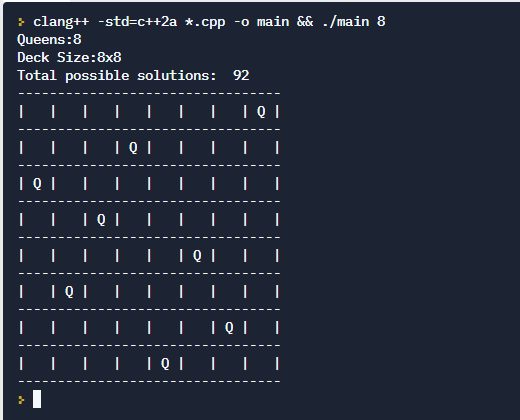

# 8-Queens-cpp
C++ project part of the LinkedIn Learning's Code Clinic series.
https://www.linkedin.com/learning/code-clinic-c-plus-plus-2/intro-eight-queens?

## Problem: 
You are provided with a NxN chess deck. Your task is to places N queens so none of the queens kill each other. N > 4. 

## Your task is to:
1. Ask user for number of queens (>4) & option to print all possible solutions.
2. Calculate solutions and based on input print either the last solution or all solutions

## Installation & test:
0. Clone the repo
1. Any C++ compiler Eg. clang or use an online IDE like replit
2. Build using the build command pertaining to the said compiler. 
  Eg. clang: "clang++ -std=c++17 *.cpp -o main && ./main"
3. Run `main.exe [Number of Queens] [Print All solutions]` Eg. `main.exe 8 1` will print all solutions to a 8 Queen problem.

## Learning objectives:
1. Learning recursion, backtracking
2. Use of memcpy
3. Object Oriented programming / design concepts